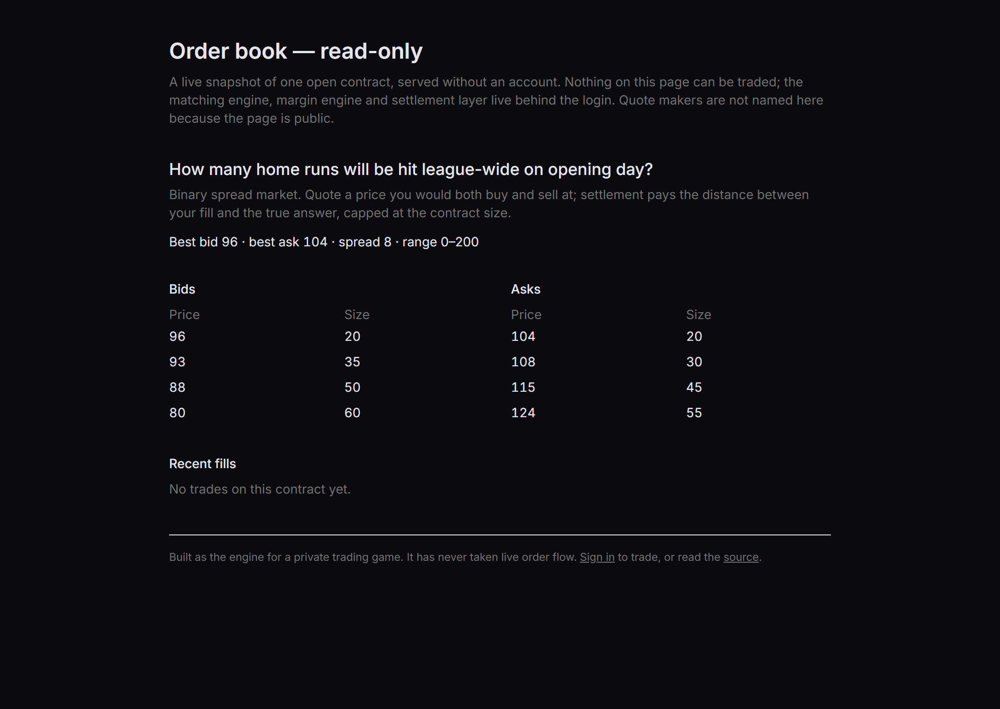

# Prediction-Market Exchange

A working exchange, built from the matching engine up. Not a backtest of one, not a
simulation — a central limit order book with price–time priority, a margin engine, and
atomic settlement, running behind a real-time web front end.

To be precise about what "working" claims: it was built as the engine for a private
trading game, and the deployment linked below is a demo. The matching, margin and
settlement paths are complete and tested; the system has never taken live order flow.

**[Repository](https://github.com/Duyanh090205/prediction-market-exchange)** · **[Live demo](https://prediction-market-exchange.onrender.com)**

Guest: read-only market-data feed · Enter as demo trader: a sandbox with play money,
expires in 24 h.

> **Authorship.** I designed and built the matching engine, margin engine and settlement
> layer — the entire trading core — and every test. By `git blame` over the source tree
> as of September 2026 (lockfile and documentation excluded), 90% of the lines are mine;
> the remaining ~1,750 are account and admin plumbing — registration, password reset,
> admin user management, the login page and parts of the session wiring — contributed by
> teammates.



*The public read-only view at [https://prediction-market-exchange.onrender.com](https://prediction-market-exchange.onrender.com), captured from the running
deployment. No account, no login wall — an unauthenticated visitor lands here.*

---

## What it does

Players trade binary spread contracts: OVER or UNDER a strike price, with fixed ±size
payouts. An administrator opens a contract on a question with one real numerical answer,
market makers post two-sided quotes, players hit them or sweep the book, and the contract
settles when the real answer is entered.

The design constraint that shaped everything: **orders execute instantly and atomically,
with no manual confirmation step anywhere in the path.** That is what makes it an
exchange rather than a message board with a ledger attached, and it is also what makes
the concurrency and margin problems real.

## Core systems

### 1. Matching engine

Price–time priority over a live order book. LIMIT orders hit a specific resting quote by
ID; MARKET orders sweep multiple price levels with slippage protection via a limit price.
Multi-level sweeps are atomic — a market order that crosses four quotes either fills
against all four or none.

Concurrent fills are the hard part. Two players hitting the same quote simultaneously
must not both fill against it. The engine takes `SELECT FOR UPDATE` row locks inside the
transaction, so the second order sees the quote already consumed rather than a stale
snapshot of it.

### 2. Margin engine, checked twice

Margin is reserved against **worst-case loss** on the position, not against notional and
not against the current mark.

The part worth talking about is that the check runs **twice**: once when the order is
submitted, and again inside the execution transaction. The first check is the fast
rejection path. The second exists because the first one is stale by the time it matters —
between submission and execution, the same user's other orders may have filled and
consumed the balance the first check approved against. Only the check that runs inside
the transaction, against locked rows, is binding.

Computing the worst case is also less obvious than it looks. A single binary position
loses at most its size, so the naive answer is to sum the per-position maxima. That is
wrong once a user holds several positions on the same contract at different strikes: the
true worst case is the minimum of *aggregate* P&L, and it can sit at a strike itself — the
push case — or between two strikes, not at either extreme. So the calculation sweeps test
points across the whole strike ladder:

```ts
const testPoints: number[] = [];
testPoints.push(strikes[0] - 1);                                  // below the lowest
for (let i = 0; i < strikes.length; i++) {
  testPoints.push(strikes[i]);                                    // the push case
  if (i < strikes.length - 1) {
    testPoints.push(Math.floor((strikes[i] + strikes[i + 1]) / 2)); // between strikes
  }
}
testPoints.push(strikes[strikes.length - 1] + 1);                 // above the highest

let worst = Infinity;
for (const tp of testPoints) {
  const pnl = positions.reduce((sum, pos) => sum + pnlForUser(pos, tp), 0);
  worst = Math.min(worst, pnl);
}
```

Getting this wrong under-reserves margin on exactly the portfolios most likely to blow
up — the ones with several offsetting positions on one contract.

### 3. Atomic settlement

When a contract settles, every position closes, every balance moves, and realized P&L
lands on the leaderboard in a single database transaction. There is no intermediate state
where some users have been paid and others have not. Settlement is the one operation
where partial failure cannot be fixed by retrying, so it gets the strictest transactional
guarantee in the system.

## Correctness

**103 tests across 13 files** — 67 unit tests covering matching, margin and P&L that
run with no setup, and 36 integration tests that exercise the same paths against a live
Postgres. The three areas covered hardest are the ones where a bug silently moves money
instead of throwing an error.

Supporting hardening: UUIDv7 idempotency keys on every state-changing operation, CSRF
protection, per-IP login rate limiting, bcrypt at factor 12, structured logging, and an
API-layer rule blocking the administrator from trading at all.

## Stack

Roughly 15.6k lines. Next.js 15 (App Router), PostgreSQL, Prisma, Socket.IO over a custom
Node server for real-time book and trade updates, Tailwind.

Eleven database tables. Migrations are additive-only by policy — no `DROP TABLE` or
`DROP COLUMN` in new migrations without an explicit maintenance window, because the
database holds settled trade history that cannot be reconstructed.

---

## Deployment

**Live at [https://prediction-market-exchange.onrender.com](https://prediction-market-exchange.onrender.com).** Render for the app,
Neon for Postgres, both on free tiers. An unauthenticated visitor gets the
read-only book; `demo@example.com` / `demo-trader-2027` signs in to trade.

The first deployment is gone — its host was retired and the domain released — and
the bug that killed it is worth naming, because diagnosing it is more interesting
than hiding it. The login flow built its return URL from the **runtime bind
address** rather than from a configured public URL. In production that resolved
to `0.0.0.0:3000`, so even a successful login redirected the user to a host that
does not exist. The fix is a public-URL environment variable, pinned in
`render.yaml`.

Standing this back up on new infrastructure turned up two more failures that only
appear on a clean machine:

- `NODE_ENV=production` makes `npm ci` skip devDependencies, and every build tool
  here — the PostCSS plugin, TypeScript, Tailwind — is a devDependency. The build
  installed 12 runtime packages and then failed resolving a PostCSS plugin.
- The login page hung on its loading state. Middleware issues a per-request CSP
  nonce, but the page was prerendered at build time, so its script tags shipped
  without one; `'strict-dynamic'` then blocks every unnonced script and hydration
  never starts. Route segment config is ignored inside a `"use client"` file, so
  the fix was to split each auth page into a server wrapper carrying
  `force-dynamic` around the client component.

Both were invisible locally, where `node_modules` was already complete and pages
were already dynamic in dev.
