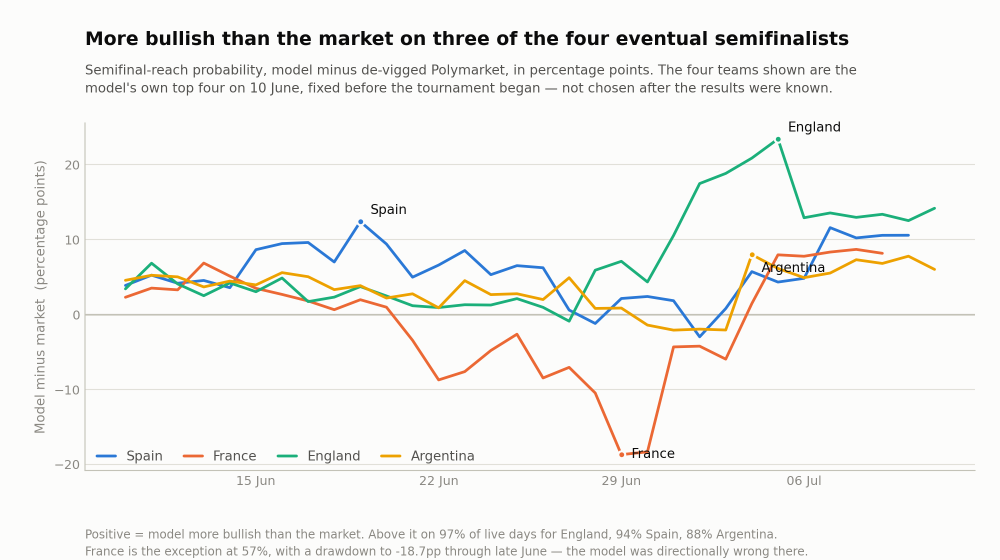

# WC2026 Monte Carlo — the locked pre-tournament top four were the exact four semifinalists

A Monte Carlo tournament simulator that prices outright (champion) markets from
structure rather than from the market, then tracked itself against Polymarket and Kalshi
for all 41 days of the 2026 World Cup.

**The model was locked on 10 June 2026, before the first match, and never re-fitted.**
Every number on this page is out-of-sample.

**[Repository](https://github.com/Duyanh090205/wc2026-monte-carlo)**

*Model minus de-vigged Polymarket on semifinal-reach probability, across the 32 days the question was still live. The four teams are the model's own top four on 10 June, fixed before kickoff. The model ran above the market on three of them and was directionally wrong on France, which is shown rather than dropped.*

---

## Problem

Outright markets on a 48-team tournament are hard to price for a reason that is
structural, not statistical: a team's championship probability depends on a bracket that
does not exist yet. Group results determine the knockout path, and the knockout path
determines who a contender actually has to beat. You cannot get at that with a
regression on team strength. You have to simulate the tournament.

The goal was never to beat the market outright. It was to build an **independent
structural prior** — something that disagrees with the market for reasons you can name.
A model that tracks the market with a stable, understood bias is more useful than one
that is occasionally more accurate for reasons nobody can reconstruct. Divergence from a
known bias is a signal. Divergence from an unknown one is noise.

## Method

Team strength comes from an as-of Elo reconstruction (eloratings.net methodology),
blended 50/50 with squad market value, plus a star-presence adjustment. Match outcomes
are drawn from a Poisson goal grid with a divisor of D=1400 and a 0.20 diagonal
inflation to get the draw rate right — Poisson alone badly under-predicts draws.

Parameters were selected by **leave-one-tournament-out cross-validation** run across 12
historical tournaments — six World Cups and six Euros, roughly 760 matches — with the
full result tables retained in the repo audits. The selection rule carries a hard guard
against overfitting: the winning parameter set must beat the runner-up by more than two
standard errors, otherwise the model falls back to defaults rather than accept a marginal
winner. Nothing was tuned on market prices at any point.

## Model locking

The model is **static during a tournament**. The daily rerun re-conditions on results
that are already locked in — it recomputes championship probabilities given what has
happened — but it never re-fits parameters on in-tournament data. Without that rule,
none of the numbers below would be evidence of anything.

The full run is 1,000,000 simulations per day, executed unattended in CI for 41
consecutive days.

---

## Results

### Champion market, locked 10 June

| | Model | Polymarket | Kalshi | Outcome |
|---|---|---|---|---|
| Spain | **19.11%** | 16.45% | 17.35% | **won** |
| France | 15.36% | 16.05% | 16.05% | lost in semifinal |
| England | 11.89% | 10.85% | 10.75% | lost in semifinal |
| Argentina | 10.39% | 8.55% | 8.65% | lost in final |

The model's top pick was the eventual champion, at a 2.7-point premium to Polymarket.

### Semifinal reach — the strongest result

The four teams the model ranked highest on semifinal probability were exactly the four
teams that reached the semifinals.

| Model rank | Team | Model | Polymarket, de-vigged (bookmaker margin removed) | Reached semifinal |
|---|---|---|---|---|
| 1 | Spain | 43.92% | 40.03% | ✔ |
| 2 | France | 39.64% | 37.33% | ✔ |
| 3 | England | 34.47% | 31.04% | ✔ |
| 4 | Argentina | 32.01% | 27.44% | ✔ |

**4 of 4** — and on 10 June the model was above the de-vigged market on every one of
them. The edge was directional across the whole top of the book, not one lucky team.
Argentina is the clearest case: the model had it 4.6 points above the market, and
Argentina went on to reach the final.

Across the full campaign that lead did not hold uniformly. Averaged over the days the
question was still live, the model ran above the market on England, Spain and Argentina
but slightly below on France — the chart above shows the drawdown.

### Knockout stage

**25 of 31 ties called correctly — 80.6%.** Two-way Brier score — mean squared error of
probability forecasts — **0.156**, against a coin-flip baseline of 0.25.

| Round | Correct |
|---|---|
| Round of 32 | 13 / 16 |
| Round of 16 | 6 / 8 |
| Quarter-final | 4 / 4 |
| Semi-final | 1 / 2 |
| Final | 1 / 1 |

### The six misses

| Round | Tie | Model favored | Won |
|---|---|---|---|
| R32 | Germany vs Paraguay | Germany, 75.1% | Paraguay |
| R32 | Morocco vs Netherlands | Netherlands, 63.4% | Morocco |
| R32 | Ecuador vs Mexico | Ecuador, 60.0% | Mexico |
| R16 | Brazil vs Norway | Brazil, 63.6% | Norway |
| R16 | Colombia vs Switzerland | Colombia, 50.5% | Switzerland |
| SF | Argentina vs England | England, 50.7% | Argentina |

Five of the six sat between 50% and 64% — ties the model was close to calling a
coin-flip anyway. Only Germany–Paraguay was a genuine high-confidence failure, and it
went to a penalty shootout, which no goal model claims to predict. That distribution is
what you want from a calibrated model: the errors cluster where it said it was unsure.

### Group stage

72 matches, **63.9%** W/D/L hit rate, multiclass Brier **0.514**.

The dashboard compares that against a uniform 1/3-1/3-1/3 baseline of 0.667. **That
baseline is a sanity check, not a benchmark** — it is the score you get from pure
ignorance, and any competent model beats it. It is reported here for completeness and
because the code computes it, but the knockout figures above are the ones that carry
information.

---

## Engineering

- 1,000,000 simulations per day, 41 consecutive days, unattended in GitHub Actions
- **282 test functions across 29 test modules**, including wiring audits and an explicit
  no-look-ahead test on the cross-validation path
- Daily model-vs-market divergence logged against both Polymarket and Kalshi, with
  de-vigging on the market side
- Full campaign is a closed record: the tracking log is frozen, not regenerated

Python · NumPy · Poisson goal grid · Elo reconstruction · Streamlit dashboard

---

## Limitations

The uniform-baseline Brier metric should never have been the headline number on the
dashboard. It flatters the model and tells a reader almost nothing. The knockout two-way
Brier against a coin flip is the honest version of the same idea, and it is the one I
lead with here.

The champion-market edge is also weaker evidence than the semifinal-reach result, even
though it is the more eye-catching one. One tournament produces exactly one champion —
n=1. The semifinal result is four independent-ish calls, and the knockout record is 31.
Sample size is the whole argument.
